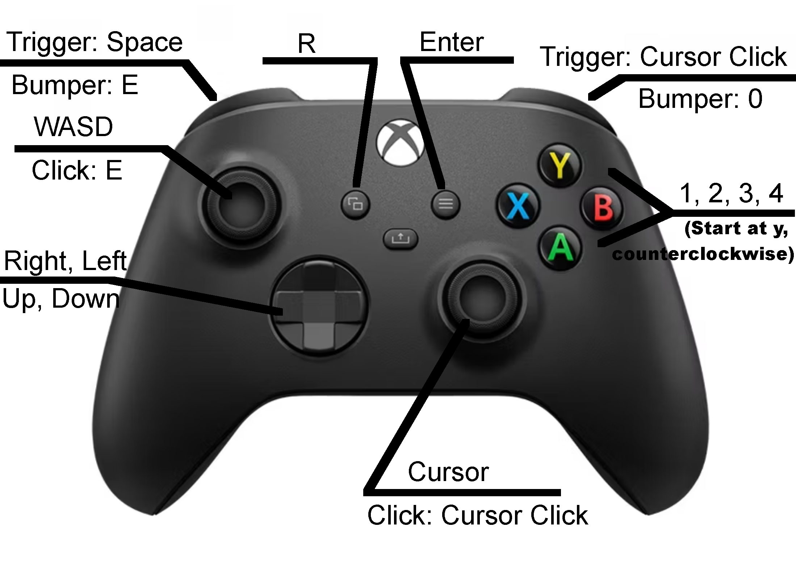

# Curse of the Forsaken Isle

Step into a vibrant pixel-art world of adventure, mystery, and danger. Battle powerful bosses, face off against formidable enemies, and befriend unique characters as you explore diverse environments. Delve into hidden caves, uncover ancient secrets, and solve intriguing mysteries. With a rich, immersive world teeming with animals and challenges, your journey will test your skills, wit, and courage at every turn. Will you uncover the truth and conquer the unknown?

**Official Website:** https://sullydux.github.io/Curse/

---

## How to Get Started

To get started, wait for the game to load, then press the green flag in the top left. After you press that, it will show a backstory for your character, which you can dismiss by pressing anywhere on the message. Now you are in the game and can play freely. For full control and help guides, press E or I to open the inventory. With the inventory open, you can hover your mouse over the two clipboards with question marks on them in the top right.

---

## Notes on Saving Game on Scratch and Turbowarp

This game can be saved on all playing platforms. It saves automatically every three minutes. When you download your save, you get a string of numbers in your copy & paste clipboard. Place it into a list, document, sticky note, or wherever you like. The game does not internally reload save data, so you have to paste the save back into the game.

---

## Notes on Saving Game on the Website

The game saves automatically every 90 seconds. When you download your save, you get a string of numbers in your copy & paste clipboard. Place it into a list, document, sticky note, or wherever you like. The game does not internally reload save data, so you have to paste the save back into the game.

The inventory also features an “On Website” switch, which you should press if you are on the GitHub-hosted website. This makes every save go to local storage in your browser so you don’t have to place the save data in a list. To reload the data after closing and reopening the tab, you have to start the game and go into the inventory menu. Next, turn the “On Website” switch to “☑️” and the game will load any save data stored.

---

## Controller Support   (Not in game yet)

This game supports controllers based on Turbowarp's [Gamepad Support Extension](https://turbowarp.org/addons#gamepad). The controller configuration is listed below and is not changeable. With a controller, everything should work except for chests (which are not vital to the game) and saving save data to an external document or list, but that can work if you have a keyboard. The game has been tested on a wireless Xbox Series S controller, but according to Turbowarp, any compatible controller can work.

**Controller Buttons:**
- A —
- B —
- X —
- Y —
- Left Bumper (LB) —
- Right Bumper (RB) —
- Left Trigger (LT) —
- Right Trigger (RT) —
- Left Stick -
- Right Stick -
- Left Stick (Press) —
- Right Stick (Press) —
- D-Pad Up —
- D-Pad Down —
- D-Pad Left —
- D-Pad Right —

---

## Credits

- Scratch — For letting me code and share the game
- Turbowarp — For letting me code and package the game to let it be on a website
- BlackFang on pixeljoint.com — Explosion GIF
- 'Menu Music' on pixabay — Day time & inventory music
- 'Glitch in the Dark' on pixabay — Night time & caves music
- 'Raining Village - Video Game Theme' on pixabay — Village music
- 'Fast Paced Boss Battle' on pixabay — Boss fight music
- 'Dragon Roar) High intensity' on pixabay.com — Basaltor's roar

---

## License

This project is licensed under the terms found here:

[View License](https://sullydux.github.io/Curse/LICENSE.txt)

